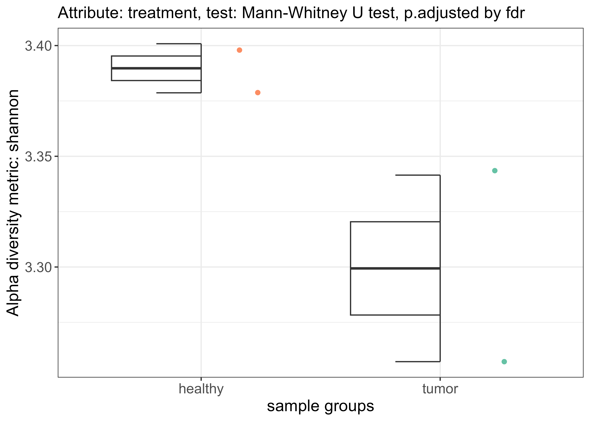
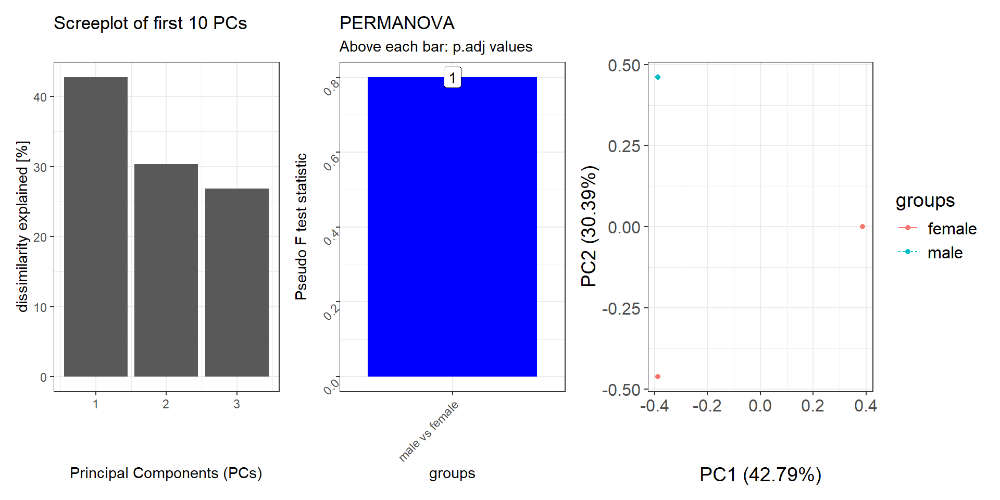
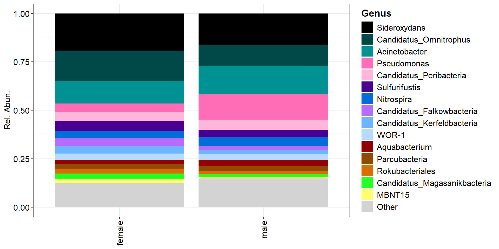

[](https://CRAN.R-project.org/package=OmicFlow)
[](https://app.codecov.io/gh/agusinac/OmicFlow)
[](https://github.com/agusinac/OmicFlow/actions/workflows/R-CMD-check.yaml)
[](https://anaconda.org/agusinac/r-omicflow)
[](https://hub.docker.com/r/agusinac/autoflow)

OmicFlow
================

## Installation
---

The latest stable version can be installed from CRAN.

``` r
install.packages('OmicFlow', dependencies = TRUE)
```

The development version is available on GitHub.

``` r
install.packages('pak') # if not yet installed
pak::pkg_install('agusinac/OmicFlow@dev')
```

## 📋 Metadata File Specification

OmicFlow expects your sample metadata to follow a **simple, but strict** structure so that all datasets are compatible and validated up‑front. Sample metadata can be supplied as a **CSV/TSV** file or as a `data.table` in R. In both cases the sample metadata should contain a header (this is your first line if you supply a file) where **each row = one sample** Additional column names not mentioned here are allowed and will be ignored during the metadata validation step.

---

### **Minimum requirement**
- **`SAMPLE_ID`** ➡ every row **must** have a unique, non‑empty sample identifier.
- No spaces are allowed in IDs — use underscores `_` or dashes `-` instead.

Example:

| SAMPLE_ID | SAMPLEPAIR_ID | CONTRAST_Treatment | VARIABLE_Age |
|-----------|---------------|--------------------|--------------|
| S1        | P1            | Drug               | 42           |
| S2        | P1            | Placebo            | 36           |
| S3        | P2            | Drug               | 51           |

---

### **Column types and naming rules**

#### 🔹 Required column
| Column       | Type    | Rules                                                |
|--------------|---------|------------------------------------------------------|
| `SAMPLE_ID`  | string  | Unique, no spaces, one per sample row                |

#### 🔹 Optional standard columns
| Column         | Type    | Rules                                                               |
|----------------|---------|---------------------------------------------------------------------|
| `SAMPLEPAIR_ID`| string  | Optional — no spaces. Use when samples are paired and belong to an individual source/subject |

#### 🔹 Pattern‑based columns
You can define extra variables using special prefixes:
- **`CONTRAST_...`** → grouping/category labels used in differential comparisons  
  Example: `CONTRAST_Treatment` with values `Drug` / `Placebo`
- **`VARIABLE_...`** → numeric or string variables for statistical analysis  
  Example: `VARIABLE_Age` with values `42`, `51`, etc.

The pattern-based columns are only used during the `autoFlow` function. At the moment only columns with prefix `CONTRAST_` are supported.
Example: **Outputs a `report.html` file in the current working directory**
```R
taxa$autoFlow(
    normalize = FALSE,
    weighted = TRUE,
    pvalue.threshold = 0.05
)
```
---

## Usage
> [!NOTE]
> Make sure your metadata meets the requirements!
---
The abstract class `omics` can be used for any type of omics data where a `treeData` is not required. Let's say you have a `metaData` and `countData` (file or a matrix with rownames), these can be supplied directly to `omics` and a `featureData` field is then automatically generated. You can change all fields via `<-` and these will be automatically synced in the background.

The `metagenomics` class has extra support for biom files in both HDF5 ([version 2](https://biom-format.org/documentation/format_versions/biom-2.0.html)) as JSON data structure to be passed via `biomData` on top of the default `omics` fields. The `proteomics` class is more an extension of the `omics` class that also allows the input of a `treeData` and performs alignment by the `treeData` tip labels.
```R
library("OmicFlow")

metadata_file <- system.file("extdata", "metadata.tsv", package = "OmicFlow")
counts_file <- system.file("extdata", "counts.tsv", package = "OmicFlow")
features_file <- system.file("extdata", "features.tsv", package = "OmicFlow")
tree_file <- system.file("extdata", "tree.newick", package = "OmicFlow")

taxa <- metagenomics$new(
    metaData = metadata_file,
    countData = counts_file,
    featureData = features_file,
    treeData = tree_file
)

taxa$feature_subset(Kingdom == "Bacteria")
taxa$normalize()

# Access variables directly
taxa$metaData
taxa$countData
taxa$featureData
taxa$treeData

# Change variables & enjoy the automatic sync
taxa$featureData <- taxa$featureData[1:100, ]

# Inspect what functions variables are available to the class
str(taxa)
```

### Visualisations
---
> [!NOTE]
> All visualizations use by default color-blind palettes!

#### 🔹Alpha diversity
```R
alpha_div <- taxa$alpha_diversity(
    col_name = "treatment",
    metric = "shannon",
    paired = FALSE # If TRUE it performs wilcox signed rank test
)

alpha_div$plot
```


#### 🔹Beta diversity
> [!NOTE]
> Since v1.5 OmicFlow computes dissimilarity metrics from both sparse and dense matrices!

By default PERMANOVA is applied pairwise against each group within the specified contrast, via `group_by` that is used in `pairwise_adonis`. The permutation design in `vegan::adonis2` is by default set to `free`. But this may not always be the right test when you have paired samples and you also want to restrict permutations between different sites or genders. Therefore, `pairwise_adonis` supports a custom permutation design, which can be constructed via [permute](https://cran.r-project.org/web/packages/permute/vignettes/permutations.html) and fed into `vegan::adonis2` as a function via `pairwise_adonis` with the flag `perm_design`. See the examples below. 
```R
set.seed(1970)

# Perform ordinations with in-built distance matrix computation
#--------------------------------------------------------------------------------
beta_div <- taxa$ordination(
    metric = "unifrac",
    method = "pcoa",
    group_by = "treatment",
    perm = 999
)

# Add a custom pre-computed distance matrix
#--------------------------------------------------------------------------------
qiime_unifrac <- data.table::fread("weighted-unifrac-matrix.tsv", header=TRUE)
distmat <- Matrix::Matrix(as.matrix(qiime_unifrac[, .SD, .SDcols = !c("V1")]))
rownames(distmat) <- colnames(distmat)
distmat <- distmat[taxa$metaData[["SAMPLE_ID"]], taxa$metaData[["SAMPLE_ID"]]]
distmat <- as.dist(distmat) 

beta_div <- taxa$ordination(
    distmat = distmat,
    method = "pcoa",
    group_by = "treatment",
    perm = 999
)

# Add a custom permutation design via `perm_design`
#--------------------------------------------------------------------------------
## taxa$ordination() automatically will input taxa$metaData inside the supplied function.
perm_design_func <- function(meta) {
  base::with(
    data = meta,
    expr = permute::how(
      nperm = 999,
      plots = permute::Plots(meta$SAMPLEPAIR_ID, type = "none"), # In case samplepair ids is supplied
      within = permute::Within(type = "free")
    )
  )
}

beta_div <- taxa$ordination(
    metric = "unifrac",
    method = "pcoa",
    group_by = "treatment",
    perm_design = perm_design_func
)

patchwork::wrap_plots(
    beta_div[c("scree_plot", "anova_plot", "scores_plot")],
    nrow = 1)
```


#### 🔹Composition
```R
res <- taxa$composition(
    feature_rank = "Genus",
    feature_filter = c("uncultured"),
    feature_top = 15,
    normalize = FALSE,
    col_name = "CONTRAST_sex"
)

composition_plot(
    data = res$data,
    palette = res$palette,
    feature_rank = "Genus",
    # If group_by = NULL, then a stacked barplot for each sample sorted alphabetically will be visualized.
    group_by = "CONTRAST_sex"
    )
```


#### 🔹Volcano plot
The `volcano_plot` will contain the average percentage abundance for each Genus between the two contrasts. Additional parameters can be used to only filter for relevant bacteria based on the `pvalue.threshold`, `foldchange.threshold` and `abundance.threshold`. The returned p-values can be adjusted and used for a new volcano plot via `OmicFlow::volcano_plot`.
```R
res <- taxa$DFE(
    feature_rank = "Genus",
    feature_filter = c("uncultured"),
    paired = FALSE,
    normalize = FALSE,
    condition.group = "CONTRAST_sex",
    condition_A = "male",
    condition_B = "female"
)

res$volcano_plot
```

## Run OmicFlow and autoFlow standalone script with docker!

> [!NOTE]
> Symbolic links do not work with mounting, please only copy the original file!

Example: **Outputs a `report.html` file in current work directory**
```bash
docker pull agusinac/autoflow:latest

docker run -it --rm -v \
    "$(pwd)":/data \             # Mount the data in a temporary directory
    -w /data \                   # set working directory
    -u $(id -u):$(id -g) \       # non-root user
    agusinac/autoflow:latest \
    autoflow \                   # autoflow R script
    -b /data/biom_with_taxonomy_hdf5.biom \
    -m /data/metadata.tsv
```

## Support
If you are having issues, please [create a ticket](https://github.com/agusinac/OmicFlow/issues)
