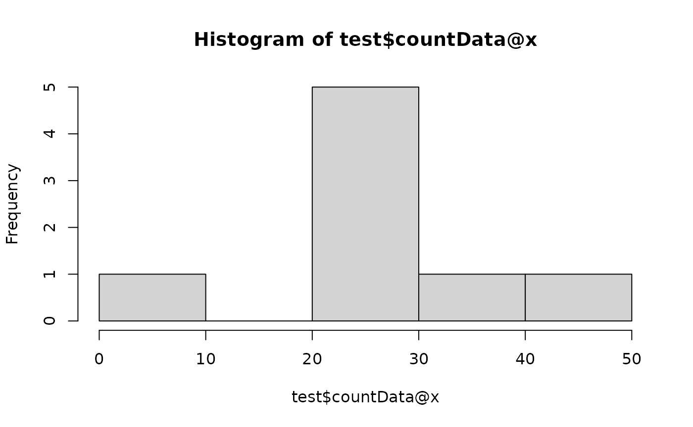
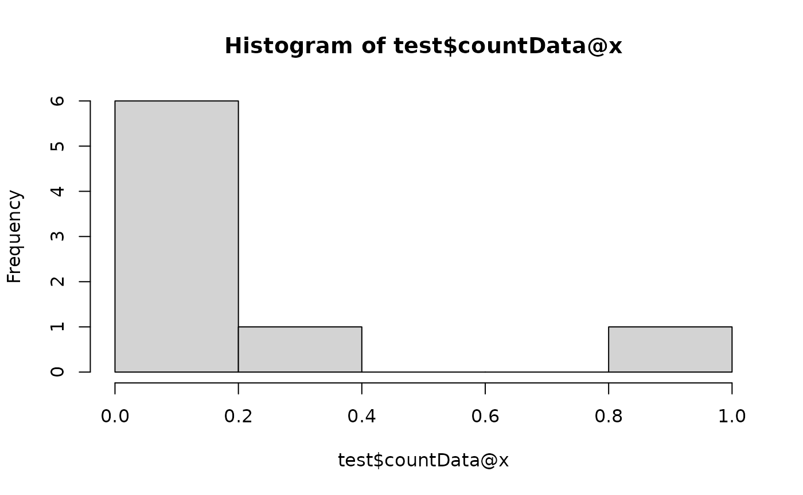
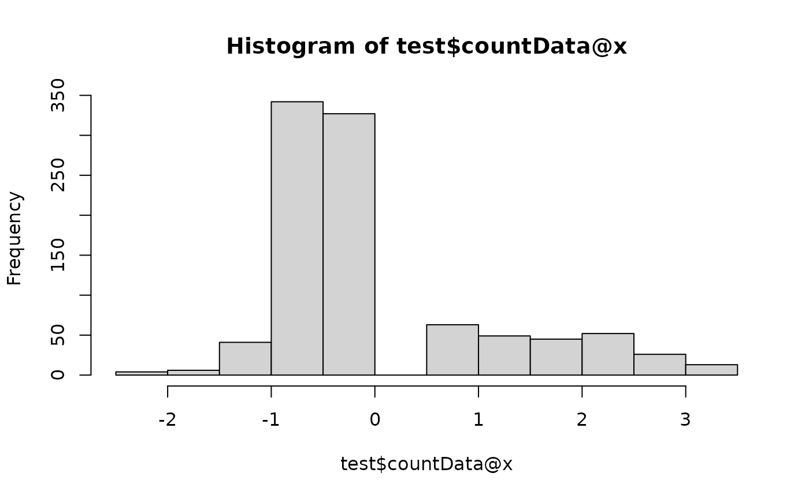
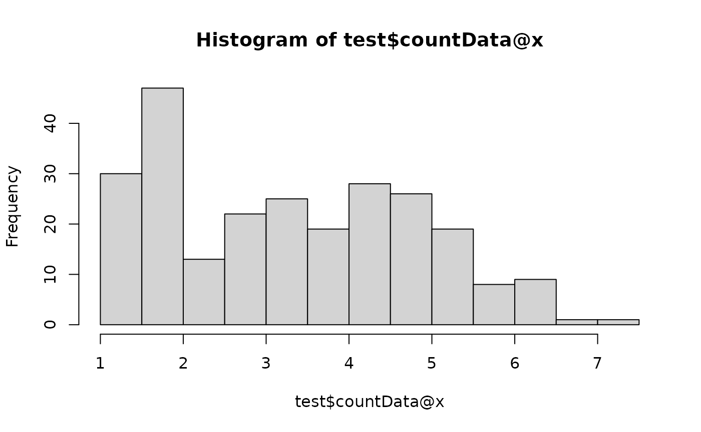

# Introduction to OmicFlow

`OmicFlow` is an R package that has been inspired by
[phyloseq](https://github.com/joey711/phyloseq), which is specifically
made for microbiome analysis. Unfortunately, phyloseq is not fast and
allocates a lot of memory, on top of that it cannot be extended to other
omics layers within the microbiome field, making it very specific to
only microbial analysis.

Here, you can find a brief introduction in how `OmicFlow` is
constructed, how to load or import your data into the framework of
`OmicFlow` and generate some standard plots.

Disclaimer: `OmicFlow` is specifically designed to load, subset and
crunch (sparse) omics data in the right format with a low memory
footprint and increased performance. Therefore, it acts as the beginning
point prior to downstream complex visualisations, statistical or machine
learning modelling. Therefore, the visualisations in `OmicFlow` are
limited.

``` r

## Automatically loads `Matrix` and `data.table` R packages
library("OmicFlow")
#> Loading required package: R6
#> Loading required package: data.table
#> 
#> Attaching package: 'data.table'
#> The following object is masked from 'package:base':
#> 
#>     %notin%
#> Loading required package: Matrix
```

## Classes

`OmicFlow` consists out of three classes, namely `omics`, `metagenomics`
and `proteomics`. The main abstract class `omics` contains most methods
that are inherited by the other sub-classes (i.e. `metagenomics` and
`proteomics`) and it can be used to load other types of omics data.

The `omics` class has only one mandatory requirement for a successful
initialization, which is the `metaData` field that should match the
[Metadata File
Specification](https://agusinac.github.io/OmicFlow/articles/metadata.md).
Additionally, it also takes as input the `countData` and `featureData`
fields, the `featureData` is constructed automatically when only the
`countData` is specified. The `featureData` first column is always the
`FEATURE_ID`, which may contain the auto-generated feature ids if the
`countData` has no `rownames` or the user feature ids if those are
present either as rownames in the `countData` original file or as loaded
`Matrix` object.

class initialization is achieved via the `$new()` operator as follows:

``` r

## Test set
metadata_file <- system.file("extdata", "metadata.tsv", package = "OmicFlow")
counts_file <- system.file("extdata", "counts.tsv", package = "OmicFlow")

## Loading only metaData
test <- omics$new(metaData = metadata_file)
#> ✔ metaData template passed the JSON validation.
#> ℹ Checking for duplicated identifiers ..

## Adding countData (should be loaded before-hand)
counts <- data.table::fread(counts_file)

# field should always be of `Matrix` class
# Notice the automatic creation of `featureData`
test$countData <- as(counts, "denseMatrix")
#> ! Placeholder featureData created.
#> 
#> ── <omics> object
#> metaData: 9 variables × 4 samples
#> countData: 4 samples × 242 features
#> featureData: 0 attributes × 242 features

## Loading with all files in one go
test <- omics$new(
  metaData = metadata_file,
  countData = counts_file
)
#> ✔ metaData template passed the JSON validation.
#> ℹ Checking for duplicated identifiers ..
#> ✔ countData is loaded.
#> ! Created placeholder featureData.
```

### `metagenomics`

The sub-class `metagenomics` contains the same fields as the `omics`
class, such as `metaData`, `countData` and `featureData`, but also
extends it to the `biomData`, `treeData` and the ability to specify the
`feature_names` which are present in the `featureData`.

``` r

metadata_file <- system.file("extdata", "metadata.tsv", package = "OmicFlow")
counts_file <- system.file("extdata", "counts.tsv", package = "OmicFlow")
features_file <- system.file("extdata", "features.tsv", package = "OmicFlow")
tree_file <- system.file("extdata", "tree.newick", package = "OmicFlow")

test <- metagenomics$new(
  metaData = metadata_file,
  countData = counts_file,
  featureData = features_file,
  treeData = tree_file
)
#> ✔ metaData template passed the JSON validation.
#> ℹ Checking for duplicated identifiers ..
#> ✔ featureData is loaded.
#> ✔ countData is loaded.
#> ✔ treeData is loaded.
#> ℹ Final steps .. cleaning & creating back-up
#> 
#> ── <metagenomics> object
#> metaData: 9 variables × 4 samples
#> countData: 4 samples × 242 features
#> featureData: 7 attributes × 242 features
#> treeData: 242 tips × 241 nodes

## BIOM example, where `featureData` and `countData` are extracted from `biomData`
# test <- metagenomics$new(
#   metaData = "metadata.csv",
#   biomData = "test.biom"
# )
```

### `proteomics`

The sub-class `proteomics` is very similar to the main `omics` class
with the addition of the `treeData` field. In all sub-classes that
contain the `treeData` field an alignment by the `treeData` is performed
to make it compatible with the `unifrac` dissimilarity functions.

## Data fields

The abstract `omics` class and their sub-classes follow the same
subsetting and active-binding fields. The active-bindings are the data
fields, such as `metaData`, `countData`, `featureData` and (optionally)
`treeData`, these can be used for both inspecting the data directly or
performing direct modifications that indirectly affects the other data
fields.

Below an example given a pre-initialised `metagenomics` class called
`test`.

``` r

## Inspecting the data fields
test
#> 
#> ── <metagenomics> object
#> metaData: 9 variables × 4 samples
#> countData: 4 samples × 242 features
#> featureData: 7 attributes × 242 features
#> treeData: 242 tips × 241 nodes

## Viewing data fields directly via the `$` operator:
test$metaData
#>    SAMPLE_ID       filename_fw      filename_rev description treatment
#>       <char>            <char>            <char>      <lgcl>    <char>
#> 1:      S100 S100_R1_.fastq.gz S100_R2_.fastq.gz          NA     tumor
#> 2:      S103 S103_R1_.fastq.gz S103_R2_.fastq.gz          NA     tumor
#> 3:      S115 S115_R1_.fastq.gz S115_R2_.fastq.gz          NA   healthy
#> 4:      S120 S120_R1_.fastq.gz S120_R2_.fastq.gz          NA   healthy
#>    CONTRAST_sex VARIABLE_BMI VARIABLE_weight VARIABLE_time
#>          <char>        <int>           <int>        <char>
#> 1:         male           22              77            A1
#> 2:       female           23              71            B1
#> 3:       female           30              69            A1
#> 4:         male           22              80            B1
test$featureData
#>                                                                                                                                                                                                                                                                                                                                FEATURE_ID
#>                                                                                                                                                                                                                                                                                                                                    <char>
#>   1:                                                                                                   GTGTCAGCAGCCGCGCAATATCGTTATCGTTATACGTCACCGTTACCATCATCTAGGAGACAACACCTACTAGACTTAAGTTTGACAGGACAGGTTCGATAATGCACGCTTAAACTAGTCAACTAGGAACTTGGAGGAGGAATGGATGTCGGATCGTACAGCAATCCTCGCTGAACGAGCGCACAGGGGCATCATCGCTCTCACGGCGGCGAAACCCGTGTAGTCC
#>   2:                                                                                                                        GTGCCAGCAGCCGACTATGGAATTGGAGGACGTGACAAATGGATACGTGCCAAAATCAATATCCAGGAACGTCCCCTGCGCGCCTTCGAAAAGAACGGATTTCTTGTGATCCAGCGCATCATTTAAGTAAAGCGCGGCATCGCAGACGTAAGGACTAAGTTTTTTCCCGTACCCCAGATACTCCTCGTAGATACCCTAGTAGTCC
#>   3:                                                                                                                                                                                                GTGTCAGCAGCCGCGGCAGGATTTAAAGTGGCAAGGGATCTGATAATTCGCAATTCCCCATTTCTGATTTCTAACGAATTCTCAAATCTTGGGTCTCAAATCTCAAAAGAACTCGGTTTTCCCCGTGTAGTCC
#>   4:    GTGCCAGCAGCCGCGGTCATCAAATTGAAACGGCAGAACGATCGGAGGATCGGAAAACTTCAGAGCTTTTTTAAAAAGTTGGTCATCCGTCGGTCCATAAACCGAACCTTCGCTCAAGGCCACATCAAGTCCGATTACCTTTGCACTTTGGAGCCGACCTAGCACCTTCCCAAAAATCTCCCGCCGCCACGGCCAGCTTCCGACGGAACCAATACTGGCATCGTCAATGCCAACGATGACGAGCTCGGCGAGAGCAGGTTTTTTTACAAAAAAACGATCGAATATTTTTTCCTGCCAGGAGTCCAGAAACCCCAGTAGTCC
#>   5:                                                                                                   GTGCCAGCAGCCGCGACCACCAATATTCCTTCTTTCCACGCATTCTGGATCGCCTCTGTCATGCTGAGAGAAGAATCATGCCCCACAAAACTAAGGTTGATAATCCGCGCCCCCATTTTTCGCGCATACTCAACTGCGTTTGCCACATCACTGGTGGCGCCCTCGCCCATGCCATTTAAAATCCGCAGGGGCATAATTTTTGCGTTCCATGAAACCCCCGTAGTCC
#>  ---                                                                                                                                                                                                                                                                                                                                     
#> 238:                                 GTGTCAGCAGCCGCGGTAATACGGGGGTGGCGAGCGTTACTCGGATTTATTGGGTGTAAAGGGCAGGTAGGCGTCTCTACAAGTTAAAAGTGAAATCCTGTGGCTCAACCACAGAACTGCTTCTAAAACTGTAGAGATTGAAGATAGGAGAGGAGAGCGGAATTCCCGGTGTAAGGGTGAAATCTGTAGATATCGGGAGGAACACCAGTGGCGAAAGCGGCTCTCTGGTCTATCCTTGACGCTAAGCTGCGAAAGCTAGGGGAGCAAACAGGATTAGAAACCCTGGTAGTCC
#> 239:                                 GTGTCAGCAGCCGCGGTAATACAGAGGTGGCGAGCGTTACTCGGATTTATTGGGTGTAAAGGGCAAGTAGGCGTCTTAACAAGTTAGAAGTGAAATCCTGCAGCTCAACTGCAGAACTGCTTTTAAAACTGTTGAGATTGAGTTTGGGAGAGGAAAGCGGAATTCTCGGTGTAAGAGTGAAATCTGTAGATATCGAGAGGAACACCGGTGGCGAAGGCGGCTTTCTGGTCCAGTACTGACGCTGAATTGCGAAAGCTAGGGGAGCAAACAGGATTAGAAACCCGAGTAGTCC
#> 240:                                 GTGTCAGCAGCCGCGGTAATACAGAGGTGGCAAGCGTTACTCGGATTTATTGGGTGTAAAGGGCAAGTAGGCGTCTTAACAAGTTAGGAGCGAAATCCTGCAGCTTAACTGCAGAACTGCTTTTAAAACTGTTGAGATTGAGTTTGGGAGAGGAAAGCGGAATTCTCGGTGTAAGAGTGAAATCTGTAGATATCGAGAGGAACACCAGTGGCGAAGGCGGCTTTCTGGTCCAATACTGACGCTGAATTGCGAAAGCTAGGGGAGCAAACAGGATTAGATACCCCCGTAGTCC
#> 241:                                GTGTCAGCAGCCGCGGTAATACAGAGGTGGCAAGCGTTGTTCGGATTTACTGGGTGTAAAGGGCACGTAGGCGGTTCGGAAAGTCGAATGTGAAATCCTATGGCTTAACCATAGAACTGCATCCGATACTTCCGGGCTAGAGTGTGGGAGAGGAAGATGGAATTCCCGGTGTAAGGGTGAAATCTGTAGATATCGGGAGGAACACCAGTGGCGAAGGCGATCTTCTGGCCCATTACTGACGCTCAGTGTGCGAAAGCAGGGGGAGCAAACGGGATTAGATACCCCGGTAGTCC
#> 242: GTGCCAGCAGCCGCGGTAATACGGAGGTGGCAAGCGTTGTTCGGATTTATTGGGTGTAAAGGGCATGTAGGTGGCCTTGCCCCGAAAGGGGTTCTTAGCGCAAGCTAAGAGTAAGTCAGATGTGAAATCCTCCCGCTCAACGGGAGAACGGCATTTGAAACTGCAAGGCTTGAGTACGGGAGAGGAGAGGGGAATTCCCGGTGTAAGAGTGAAATCTGTAGATATCGGGAGGAACACCAGTGGCGAAGGCGCCTCTCTGGCCCAGTTCTGACACTGAAATGCGAAAGCTAGGGGAGCAAACAGGATTAGAAACCCTGGTAGTCC
#>         Kingdom            Phylum       Class         Order         Family
#>          <char>            <char>      <char>        <char>         <char>
#>   1: Unassigned                                                           
#>   2: Unassigned                                                           
#>   3: Unassigned                                                           
#>   4: Unassigned                                                           
#>   5: Unassigned                                                           
#>  ---                                                                      
#> 238:   Bacteria Verrucomicrobiota Omnitrophia Omnitrophales Omnitrophaceae
#> 239:   Bacteria Verrucomicrobiota Omnitrophia Omnitrophales Omnitrophaceae
#> 240:   Bacteria Verrucomicrobiota Omnitrophia Omnitrophales Omnitrophaceae
#> 241:   Bacteria Verrucomicrobiota Omnitrophia Omnitrophales Omnitrophaceae
#> 242:   Bacteria Verrucomicrobiota Omnitrophia Omnitrophales Omnitrophaceae
#>                       Genus                Species
#>                      <char>                 <char>
#>   1:                                              
#>   2:                                              
#>   3:                                              
#>   4:                                              
#>   5:                                              
#>  ---                                              
#> 238: Candidatus_Omnitrophus   uncultured_bacterium
#> 239: Candidatus_Omnitrophus                       
#> 240: Candidatus_Omnitrophus                       
#> 241: Candidatus_Omnitrophus Candidatus_Omnitrophus
#> 242: Candidatus_Omnitrophus   uncultured_bacterium

## Modifying a single data field has an effect on other data fields
test$metaData <- test$metaData[treatment == "tumor"]
#> 
#> ── <metagenomics> object 
#> metaData: 9 variables × 2 samplescountData: 2 samples × 115 featuresfeatureData: 7 attributes × 115 featurestreeData: 115 tips × 114 nodes
```

### `copy` and `reset`

You have probably noticed by now that classes in `OmicFlow` do not
return a new object. This is done on purpose to prevent the additional
clutter of objects, and the higher memory footprint that arises.
Therefore, all modifications are done in place when it comes to
modifying the class object. Upon the first initialization of the class,
a backup of the data is created, and the user can revert back to that
point via the `reset` function.

The backup is modified when a `copy` of the data is created, then the
backup point is set at the time when the copy has been made. Often when
you are not happy with the flow of your subsetting/scaling strategy, the
`reset` can be used to revert back or create multiple copies.

``` r

## Using the `test` from the previous example where only `tumor` is selected
test2 <- test$copy()
test2
#> 
#> ── <metagenomics> object
#> metaData: 9 variables × 2 samples
#> countData: 2 samples × 115 features
#> featureData: 7 attributes × 115 features
#> treeData: 115 tips × 114 nodes

test$reset()
test
#> 
#> ── <metagenomics> object 
#> metaData: 9 variables × 4 samplescountData: 4 samples × 242 featuresfeatureData: 7 attributes × 242 featurestreeData: 242 tips × 241 nodes
```

### Subsetting

Data modifications can be achieved by changing a single data field via
the active-binding or you can use in-built subsetting functions, such as
`feature_subset`, `sample_subset`, `samplepair_subset`.

``` r

test$sample_subset(treatment == "tumor")
#> 
#> ── <metagenomics> object
#> metaData: 9 variables × 2 samples
#> countData: 2 samples × 115 features
#> featureData: 7 attributes × 115 features
#> treeData: 115 tips × 114 nodes

test$feature_subset(Genus == "Acinetobacter")
#> 
#> ── <metagenomics> object 
#> metaData: 9 variables × 2 samplescountData: 2 samples × 8 featuresfeatureData: 7 attributes × 8 featurestreeData: 8 tips × 7 nodes
```

### scaling

The transformation or standardisation of the `countData` can be achieved
via the `scale` function, which performs normalisation methods or
transformations together or independently.

``` r

## Original data
hist(test$countData@x)
```



``` r


# Normalisation
test$scale(method = "tss")
hist(test$countData@x)
```



``` r


# Standardisation
test$reset()
## CLR skips zero's if pseudocount is not added
test$scale(method = "clr")
hist(test$countData@x)
```



``` r


# Transformation
test$reset()
test$scale(method = "none", transform = log2)
hist(test$countData@x)
```



## Visualisations

Different visualisation strategies can be used depending on the data and
normalisation approach. Some functions work differently in different
classes. Examples of visualisations can be further explored here:

- [Visualisations &
  Statistics](https://agusinac.github.io/OmicFlow/articles/visualisation.md)
