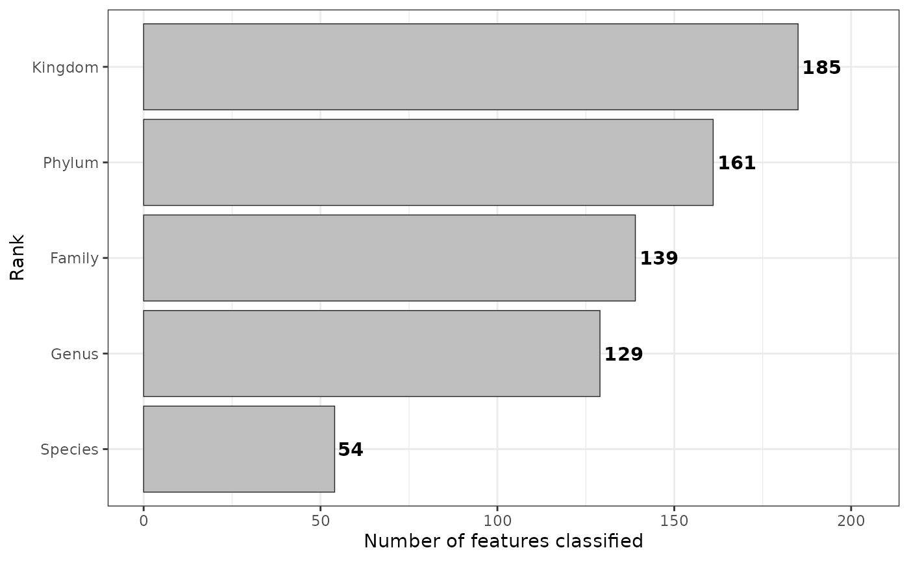
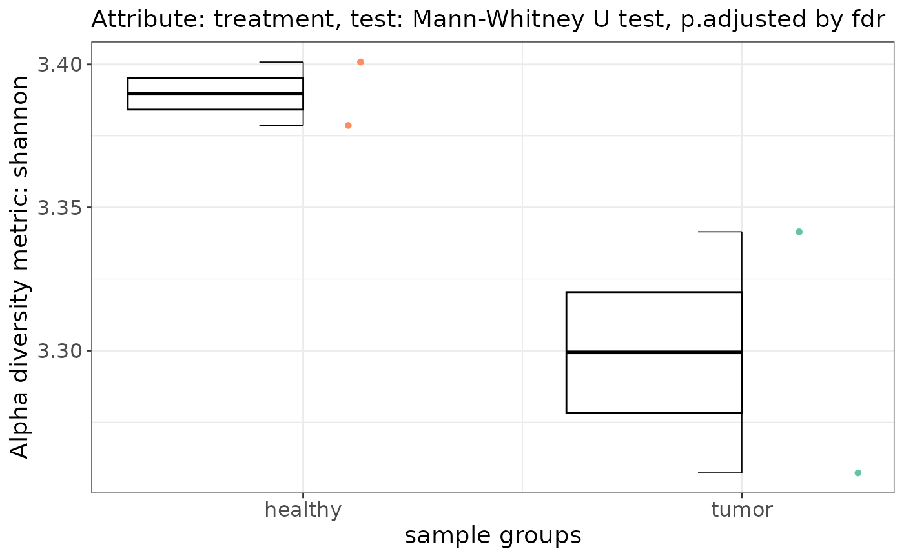
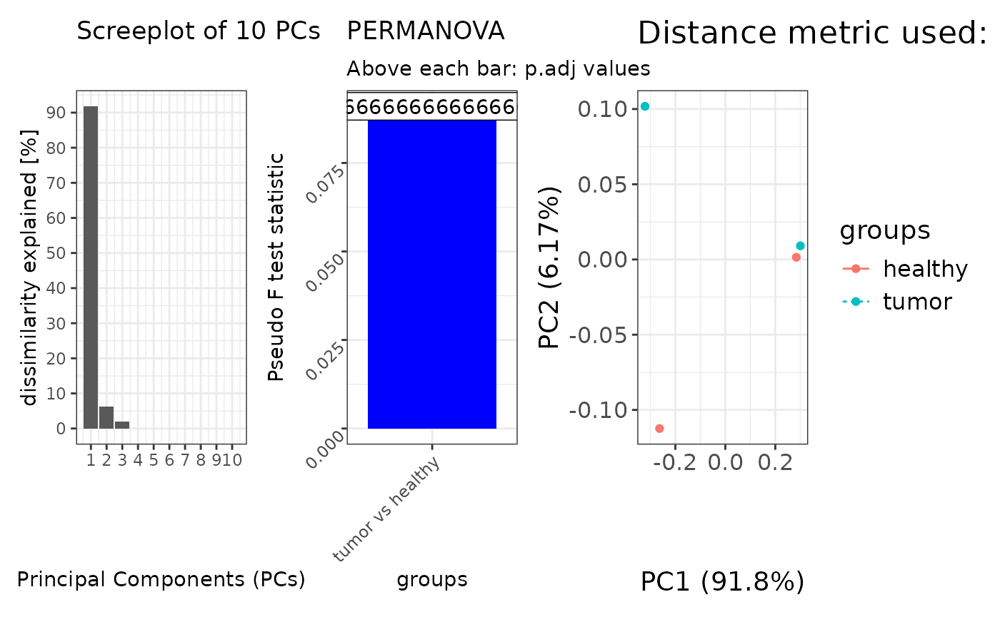
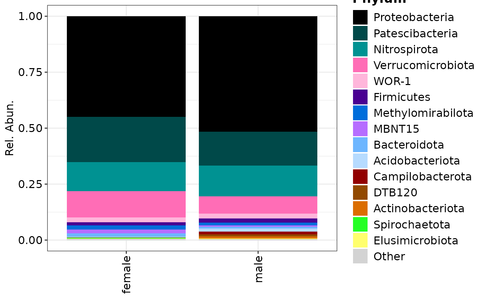
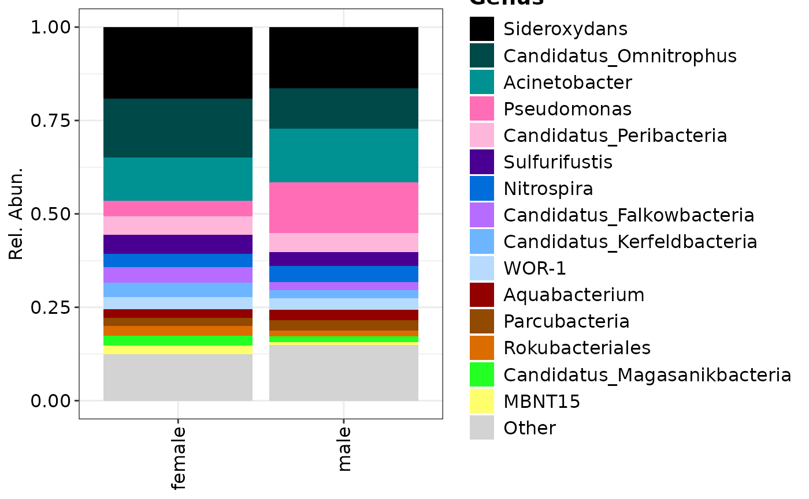
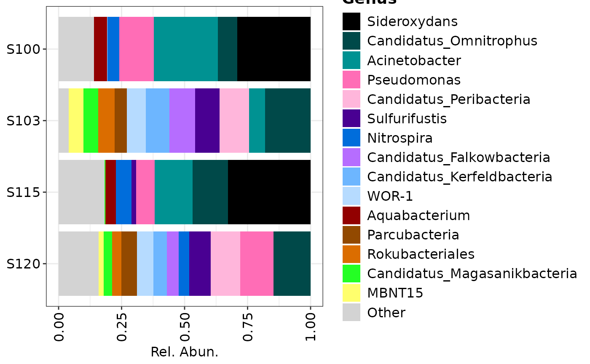

# Visualisations & Statistics

Here we give some examples in how to use the `metagenomics` class from
loading your data to visualization and some statistical testing. In the
study of microbial communities we often look at the alpha-
(i.e. `alpha_diversity` function), beta- (i.e. `ordination` function)
diversities, and compositions and or fold-change differences.

The following functions do not change the object itself and always
output the results.

- `rankstat`
- `alpha_diversity`
- `ordination`
- `composition`
- `foldchange`

Other similar functions that are not discussed:

- `distance` -
  [docs](https://agusinac.github.io/OmicFlow/reference/omics.html#omics-distance-)
- `autoFlow` -
  [docs](https://agusinac.github.io/OmicFlow/reference/omics.html#omics-autoflow-)

### Loading and data-wrangling

Below an example is shown for creating a `metagenomics` class from text
files. The same procedure is also possible via `biomData` see the
[metagenomics\$new](https://agusinac.github.io/OmicFlow/reference/metagenomics.html#metagenomics-new-),
and the loaded files from text or BIOM can also be written out as a
`BIOM` formatted hdf5 file via
[write_biom](https://agusinac.github.io/OmicFlow/reference/metagenomics.html#method-metagenomics-write_biom).

``` r

library("OmicFlow")
#> Loading required package: R6
#> Loading required package: data.table
#> 
#> Attaching package: 'data.table'
#> The following object is masked from 'package:base':
#> 
#>     %notin%
#> Loading required package: Matrix
library("ggplot2")

## Loading example set
metadata_file <- system.file("extdata", "metadata.tsv", package = "OmicFlow")
counts_file <- system.file("extdata", "counts.tsv", package = "OmicFlow")
features_file <- system.file("extdata", "features.tsv", package = "OmicFlow")
tree_file <- system.file("extdata", "tree.newick", package = "OmicFlow")

## Initializing taxa object
taxa <- metagenomics$new(
  metaData = metadata_file,
  countData = counts_file,
  featureData = features_file,
  treeData = tree_file
)
#> ✔ metaData template passed the JSON validation.
#> ℹ Checking for duplicated identifiers ..
#> ✔ featureData is loaded.
#> ✔ countData is loaded.
#> ✔ treeData is loaded.
#> ℹ Final steps .. cleaning & creating back-up
#> 
#> ── <metagenomics> object
#> metaData: 9 variables × 4 samples
#> countData: 4 samples × 242 features
#> featureData: 7 attributes × 242 features
#> treeData: 242 tips × 241 nodes

## Subseting to `Bacteria`
taxa$feature_subset(Kingdom == "Bacteria")
#> 
#> ── <metagenomics> object 
#> metaData: 9 variables × 4 samplescountData: 4 samples × 185 featuresfeatureData: 7 attributes × 185 featurestreeData: 185 tips × 184 nodes

## Classical total-sum scaling by sample-level
taxa$scale(method = "tss")
```

### Number of classified ASVs

``` r

plt <- taxa$rankstat(feature_ranks = c("Kingdom", "Phylum", "Family", "Genus", "Species"))
plt
```



Please visit
[rankstat](https://agusinac.github.io/OmicFlow/reference/omics.html#omics-rankstat-)
for more information.

### Alpha- and Beta-diversity

#### Alpha diversity

``` r

alpha_res <- taxa$alpha_diversity(
  col_name = "treatment",
  metric = "shannon",
  paired = FALSE # If TRUE it performs wilcox signed rank test
)
alpha_res$plot
```



Please visit [alpha-diversity
docs](https://agusinac.github.io/OmicFlow/reference/omics.html#omics-alpha-diversity-)
for more information.

#### Beta diversity

By default PERMANOVA is applied pairwise against each group within the
specified contrast, via `group_by` that is used in `pairwise_adonis`.
The permutation design in
[`vegan::adonis2`](https://vegandevs.github.io/vegan/reference/adonis.html)
is by default set to `free`. But this may not always be the right test
when you have paired samples and you also want to restrict permutations
between correlated values. Therefore, `pairwise_adonis` supports a
custom permutation design, which can be constructed via
[permute](https://cran.r-project.org/web/packages/permute/vignettes/permutations.html)
and fed into
[`vegan::adonis2`](https://vegandevs.github.io/vegan/reference/adonis.html)
as a function via `pairwise_adonis` with the flag `perm_design`.

Performing ordination with tests without a permutation design

``` r

set.seed(1970)

# Perform ordinations with in-built distance matrix computation
#--------------------------------------------------------------------------------
beta_div <- taxa$ordination(
    metric = "unifrac",
    method = "pcoa",
    group_by = "treatment",
    perm = 999
)
#> 'nperm' >= set of all permutations: complete enumeration.
#> Set of permutations < 'minperm'. Generating entire set.

patchwork::wrap_plots(
    beta_div[c("scree_plot", "anova_plot", "scores_plot")],
    nrow = 1)
#> Warning: Removed 7 rows containing missing values or values outside the scale range
#> (`geom_col()`).
#> Too few points to calculate an ellipse
#> Too few points to calculate an ellipse
#> Warning: Removed 2 rows containing missing values or values outside the scale range
#> (`geom_path()`).
```



Beta-diversity with a custom dissimilarity matrix

``` r

# Add a custom pre-computed distance matrix (e.g. from QIIME2)
#--------------------------------------------------------------------------------
qiime_unifrac <- data.table::fread("weighted-unifrac-matrix.tsv", header=TRUE)
distmat <- Matrix::Matrix(as.matrix(qiime_unifrac[, .SD, .SDcols = !c("V1")]))
rownames(distmat) <- colnames(distmat)
distmat <- distmat[taxa$metaData[["SAMPLE_ID"]], taxa$metaData[["SAMPLE_ID"]]]
distmat <- as.dist(distmat) 

beta_div <- taxa$ordination(
    distmat = distmat,
    method = "pcoa",
    group_by = "treatment",
    perm = 999
)
```

Beta-diversity with a permutation design, you can also run
`pairwise_adonis` outside of the classes, check the
[docs](https://agusinac.github.io/OmicFlow/reference/pairwise_adonis.html).

``` r

# Add a custom permutation design via `perm_design`
#--------------------------------------------------------------------------------
## taxa$ordination() automatically will input taxa$metaData inside the supplied function.
perm_design_func <- function(meta) {
  base::with(
    data = meta,
    expr = permute::how(
      nperm = 999,
      plots = permute::Plots(meta$SAMPLEPAIR_ID, type = "none"), # In case samplepair ids is supplied
      within = permute::Within(type = "free")
    )
  )
}

beta_div <- taxa$ordination(
    metric = "unifrac",
    method = "pcoa",
    group_by = "treatment",
    perm_design = perm_design_func
)
```

Please visit [beta-diversity
docs](https://agusinac.github.io/OmicFlow/reference/omics.html#omics-ordination-)
for more information

### Compositions of bacteria

Compositional plots can be made from stacks or over all samples, the
`feature_rank` uses
[feature_merge](https://agusinac.github.io/OmicFlow/reference/omics.html#omics-feature-merge-)
in the background but it doesn’t modify the object.

``` r

## Plotting only Phylum rank
phylum <- taxa$composition(
  feature_rank = "Phylum",
  
  # This can be a vector of multiple keywords or `NULL`
  feature_filter = c("uncultured"),
  
  # The maximum is 15 for visualisation purposes.
  feature_top = 15,
  
  # This can be a vector of multiple keywords
  col_name = "CONTRAST_sex"
)
#> 
#> ── <metagenomics> object
#> metaData: 9 variables × 4 samples
#> countData: 4 samples × 20 features
#> featureData: 7 attributes × 20 features
#> treeData: 20 tips × 19 nodes

composition_plot(
  data = phylum$data,
  palette = phylum$palette,
  feature_rank = "Phylum",
  group_by = "CONTRAST_sex"
)
```



``` r

taxa
#> 
#> ── <metagenomics> object 
#> metaData: 9 variables × 4 samplescountData: 4 samples × 185 featuresfeatureData: 7 attributes × 185 featurestreeData: 185 tips × 184 nodes

## Plotting only Genus rank
genera <- taxa$composition(
  feature_rank = "Genus",
  feature_filter = c("uncultured"),
  feature_top = 15,
  col_name = "CONTRAST_sex"
)
#> 
#> ── <metagenomics> object 
#> metaData: 9 variables × 4 samplescountData: 4 samples × 56 featuresfeatureData: 7 attributes × 56 featurestreeData: 56 tips × 55 nodes

## Plotting genera grouped by samples
composition_plot(
  data = genera$data,
  palette = genera$palette,
  feature_rank = "Genus",
  group_by = "CONTRAST_sex"
)
```



``` r


## Plotting only genera over all samples
composition_plot(
  data = genera$data,
  palette = genera$palette,
  feature_rank = "Genus"
)
```



### Fold-change

The `foldchange` of the `metagenomics` class differs from those in
`omics` and `proteomics`. Namely, it expects the data to be
proportional, and it cannot handle log-transformed data. **This will
soon change!**

``` r

taxa$foldchange(
  feature_rank = "Genus",
  paired = FALSE,
  condition.group = "treatment",
  
  # Able to split your data into male/female
  group_by = "CONTRAST_sex",
  condition_A = c("healthy"),
  condition_B = c("tumor")
)
```

Please visit
[foldchange](https://agusinac.github.io/OmicFlow/reference/metagenomics.html#metagenomics-foldchange-)
for more information.

## Proteomics

In the case of `proteomics` or other `omics` classes, not all functions
discussed here can be applied. For example in the context of proteomics,
data is often log-transformed and methods such as unifrac or
alpha-diversity metrics cannot be applied on data with negative values.
On top of that, visualising compositions or `rankstat` isn’t always
informative. Therefore, other omics data often follow the
log-transformed route, where `ordination` with the `euclidean` distance
can be applied to investigate differences in communities, followed by
fold-change differences.
