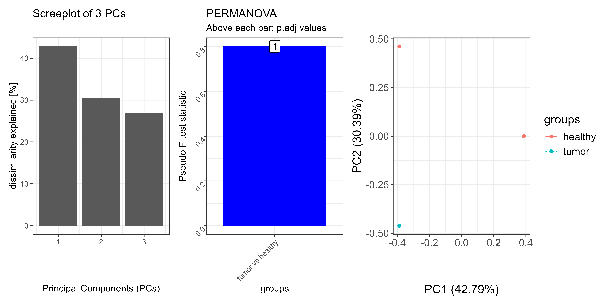
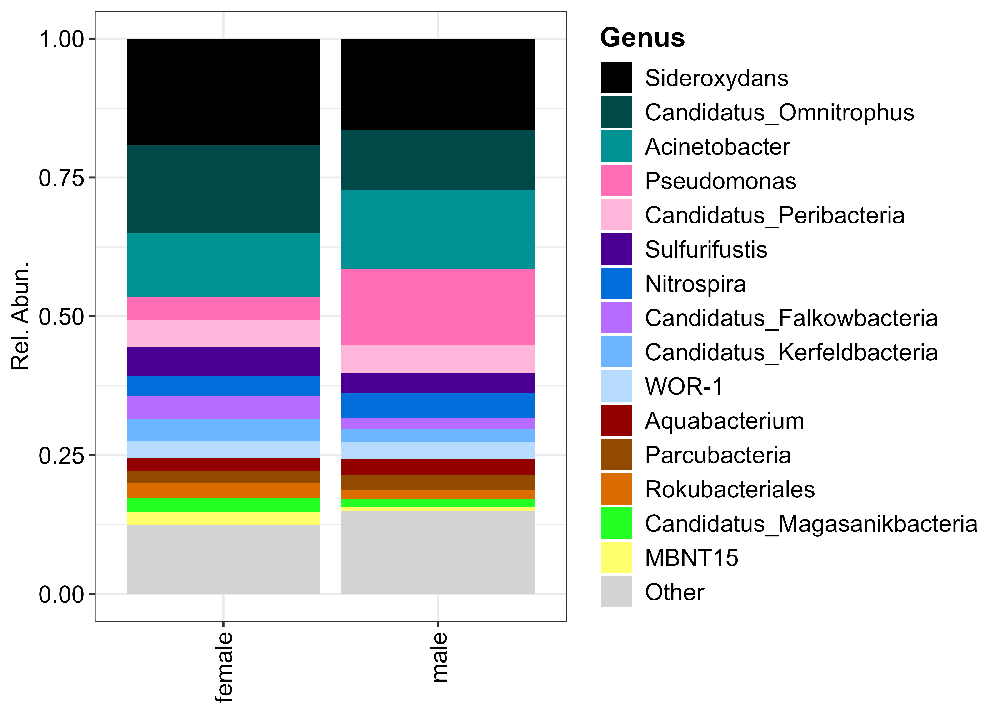

# OmicFlow

[](https://CRAN.R-project.org/package=OmicFlow)
[](https://app.codecov.io/gh/agusinac/OmicFlow)
[](https://github.com/agusinac/OmicFlow/actions/workflows/R-CMD-check.yaml)
[](https://anaconda.org/agusinac/r-omicflow)
[](https://hub.docker.com/r/agusinac/autoflow)

## Overview

OmicFlow is a generalised data structure for fast and efficient loading
of various sparse omics data. It can handle metataxonomics/metagenomics
data in text or
[BIOM](https://biom-format.org/documentation/format_versions/biom-2.0.html)
and extends to `proteomics` and other `omics` types. It also supports
non-sparse data, but it’s performance peaks in sparsity.

## \## Installation

The latest stable version can be installed from CRAN.

``` r

install.packages('OmicFlow', dependencies = TRUE)
```

The development version is available on GitHub.

``` r

install.packages('pak') # if not yet installed
pak::pkg_install('agusinac/OmicFlow@dev')
```

## \## Usage

Initialize the `metagenomics` or any `omics` object from a filepath or
pre-loaded object.

``` r

library("OmicFlow")

metadata_file <- system.file("extdata", "metadata.tsv", package = "OmicFlow")
counts_file <- system.file("extdata", "counts.tsv", package = "OmicFlow")
features_file <- system.file("extdata", "features.tsv", package = "OmicFlow")
tree_file <- system.file("extdata", "tree.newick", package = "OmicFlow")

taxa <- metagenomics$new(
    metaData = metadata_file,
    countData = counts_file,
    featureData = features_file,
    treeData = tree_file
)

taxa$feature_subset(Kingdom == "Bacteria")
taxa$scale(method = "tss")

# Access variables directly
taxa$metaData
taxa$countData
taxa$featureData
taxa$treeData

# Change variables & enjoy the automatic sync
taxa$featureData <- taxa$featureData[1:100, ]

# Inspect what functions variables are available to the class
str(taxa)
```

## \### Visualisations

#### 🔹Alpha diversity

``` r

alpha_div <- taxa$alpha_diversity(
    col_name = "treatment",
    metric = "shannon",
    paired = FALSE # If TRUE it performs wilcox signed rank test
)

alpha_div$plot
```


#### 🔹Beta diversity

By default PERMANOVA is applied pairwise against each group within the
specified contrast, via `group_by` that is used in `pairwise_adonis`.
The permutation design in
[`vegan::adonis2`](https://vegandevs.github.io/vegan/reference/adonis.html)
is by default set to `free`. But this may not always be the right test
when you have paired samples and you also want to restrict permutations
between correlated values. Therefore, `pairwise_adonis` supports a
custom permutation design, which can be constructed via
[permute](https://cran.r-project.org/web/packages/permute/vignettes/permutations.html)
and fed into
[`vegan::adonis2`](https://vegandevs.github.io/vegan/reference/adonis.html)
as a function via `pairwise_adonis` with the flag `perm_design`.

``` r

set.seed(1970)

# Perform ordinations with in-built distance matrix computation
#--------------------------------------------------------------------------------
beta_div <- taxa$ordination(
    metric = "unifrac",
    method = "pcoa",
    group_by = "treatment",
    perm = 999
)

# Add a custom pre-computed distance matrix
#--------------------------------------------------------------------------------
qiime_unifrac <- data.table::fread("weighted-unifrac-matrix.tsv", header=TRUE)
distmat <- Matrix::Matrix(as.matrix(qiime_unifrac[, .SD, .SDcols = !c("V1")]))
rownames(distmat) <- colnames(distmat)
distmat <- distmat[taxa$metaData[["SAMPLE_ID"]], taxa$metaData[["SAMPLE_ID"]]]
distmat <- as.dist(distmat) 

beta_div <- taxa$ordination(
    distmat = distmat,
    method = "pcoa",
    group_by = "treatment",
    perm = 999
)

# Add a custom permutation design via `perm_design`
#--------------------------------------------------------------------------------
## taxa$ordination() automatically will input taxa$metaData inside the supplied function.
perm_design_func <- function(meta) {
  base::with(
    data = meta,
    expr = permute::how(
      nperm = 999,
      plots = permute::Plots(meta$SAMPLEPAIR_ID, type = "none"), # In case samplepair ids is supplied
      within = permute::Within(type = "free")
    )
  )
}

beta_div <- taxa$ordination(
    metric = "unifrac",
    method = "pcoa",
    group_by = "treatment",
    perm_design = perm_design_func
)

patchwork::wrap_plots(
    beta_div[c("scree_plot", "anova_plot", "scores_plot")],
    nrow = 1)
```



#### 🔹Composition

``` r

res <- taxa$composition(
    feature_rank = "Genus",
    feature_filter = c("uncultured"),
    feature_top = 15,
    col_name = "CONTRAST_sex"
)

composition_plot(
    data = res$data,
    palette = res$palette,
    feature_rank = "Genus",
    # If group_by = NULL, then a stacked barplot for each sample sorted alphabetically will be visualized.
    group_by = "CONTRAST_sex"
    )
```



## Docker

Example: **Outputs a `report.html` file in current work directory**

``` bash
docker pull agusinac/autoflow:latest

docker run -it --rm -v \
    "$(pwd)":/data \             # Mount the data in a temporary directory
    -w /data \                   # set working directory
    -u $(id -u):$(id -g) \       # non-root user
    agusinac/autoflow:latest \
    autoflow \                   # autoflow R script
    -b /data/biom_with_taxonomy_hdf5.biom \
    -m /data/metadata.tsv
```

## Support

If you are having issues, please [create a
ticket](https://github.com/agusinac/OmicFlow/issues)
